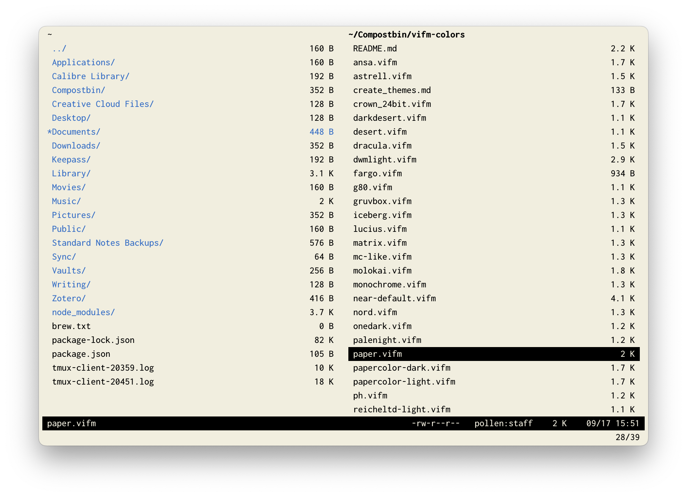
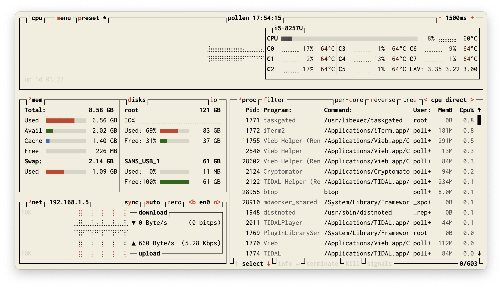
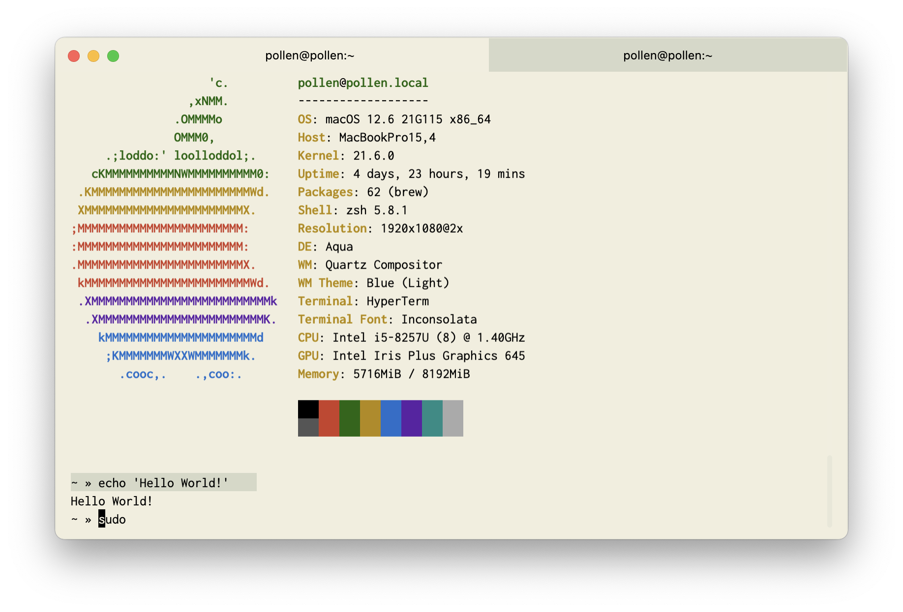
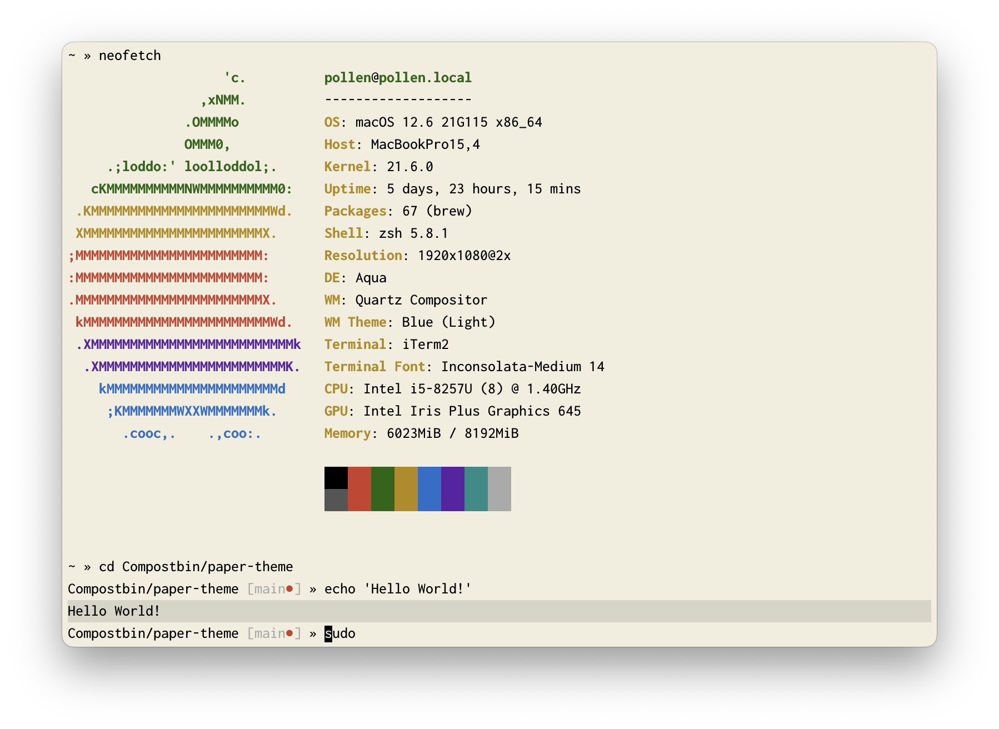
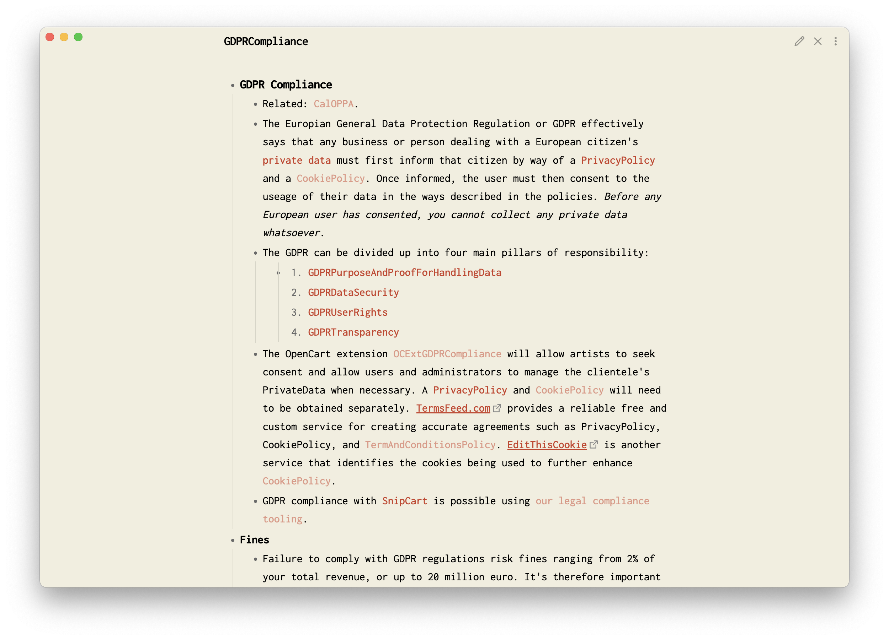
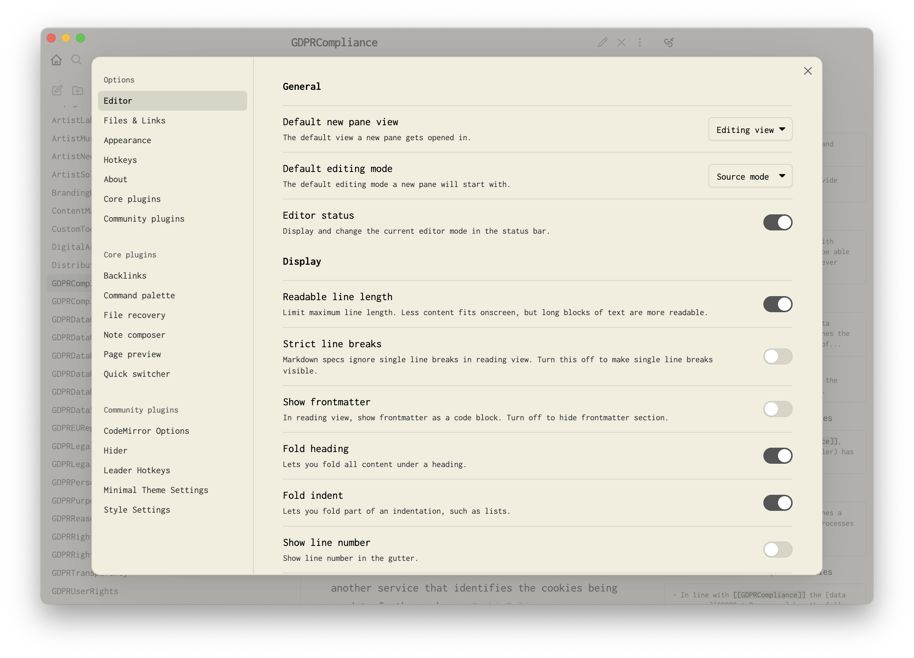

# Paper Theme
The original way to read.

## Introduction & Philosophy
*Paper* is an extremely legible, light colour palette “based on the colour of paper as found in various notebooks,” and originally created by [Yorick Peterse](https://gitlab.com/yorickpeterse). As a result, *Paper* is [healthier for our eyes](https://ux.stackexchange.com/questions/53264/dark-or-white-color-theme-is-better-for-the-eyes), making it the optimal choice for long-term viewing and a necessity in digital life.

Keeping to the [minimalist spirit of the original](https://gitlab.com/yorickpeterse/vim-paper) `vim` plugin, only the most essential information is differentiated with colour. By using fewer colours reminiscent of a multi-pen, only the important is clearly identified, further enhancing *Paper’s* legibility in many applications.

Please note that the palette has been designed with the following display properties in mind:

- An LCD/TFT display
- A display temperature range of 4000K-5200K
- A low display brightness

## Supported Applications
To submit application requests please raise an issue or feel free to contribute via a pull request. Cheers!

### Browsers
- **Vieb** (It’s pronounced ‘veep’ like ‘sheep’) -- [[Source]](themes/vieb)
    - Includes default and compact layouts; and follow-mode hinting colours reminiscent of traditional highlighters.
### File Managers
- **vifm** -- Install via the [vifm-colors repository](https://github.com/vifm/vifm-colors/).
    - Palette has been applied in line with `exa`’s [File Class Colours](https://the.exa.website/docs/colour-themes).
    - 

        
Screenshot

        

            
        

    

### Resource Monitors
- **Bashtop** -- [[Source]](themes/bashtop)
    - 

        
Screenshot

        

             
        

     

### Terminals
- **Alacritty** -- Install via the [alacritty-themes](https://github.com/rajasegar/alacritty-themes) repository.
    - 

        
Screenshot

        

             
        

     

- **Hyper** -- Available via [npm](https://www.npmjs.com/package/hyper-paper): simply run `hyper i hyper-paper` inside Hyper.
    - 

        
Screenshot

        

             
        

     

- **iTerm2** -- [[Source]](themes/iterm)
    - 

        
Screenshot

        

             
        

     

### Text Editors
- **Obsidian** -- [[Source]](themes/obsidian)
    - 

        
Screenshots

        

             
             
        

     

- **(Neo)Vim** -- *The original* [Paper Theme](https://gitlab.com/yorickpeterse/vim-paper) c/o @YorickPeterse.
    - 

        
Screenshot

        

             
        

     

- **Visual Studio Code** -- Install via [VS Marketplace](https://marketplace.visualstudio.com/items?itemName=18kimn.notebook-theme) c/o @18kimn (Nathan Kim).

## The Palette

| Color   | Normal    | Bright    | GNOME Terminal color index
|:--------|:----------|:----------|:--------------------------
| Black   | `#000000` | `#555555` | 0, 8
| Red     | `#CC3E28` | `#CC3E28` | 1, 9
| Green   | `#216609` | `#216609` | 2, 10
| Yellow  | `#B58900` | `#B58900` | 3, 11
| Blue    | `#1E6FCC` | `#1E6FCC` | 4, 12
| Purple  | `#5C21A5` | `#5C21A5` | 5, 13
| Cyan    | `#158c86` | `#158c86` | 6, 14
| White   | `#AAAAAA` | `#AAAAAA` | 7, 15

For the text color, highlight color, etc, use:

| Color     | Foreground | Background
|:----------|:-----------|:------------
| Text      | `#000000`  | `#F2EEDE`
| Highlight | `#000000`  | `#D8D5C7`

## Thanks
This project would not be possible without [Yorick’s](https://gitlab.com/yorickpeterse) work -- cheers mate!

## License
All source code in this repository is licensed under the Mozilla Public License version 2.0, unless stated otherwise. A copy of this license can be found in the file "LICENSE".
